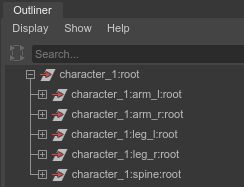
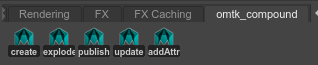
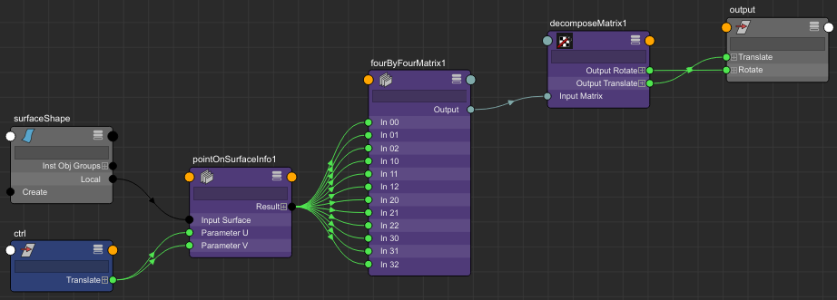
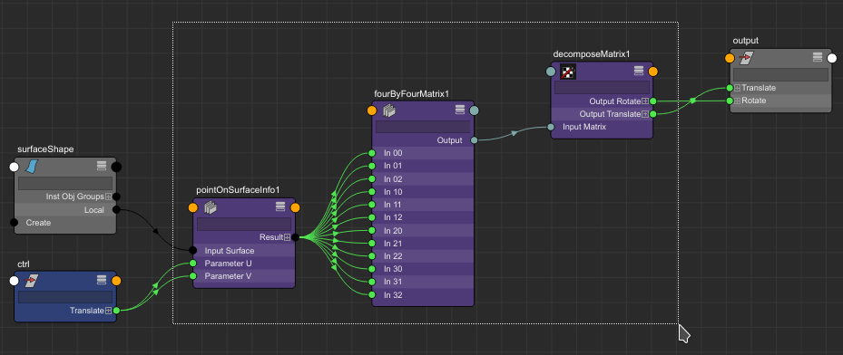
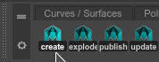
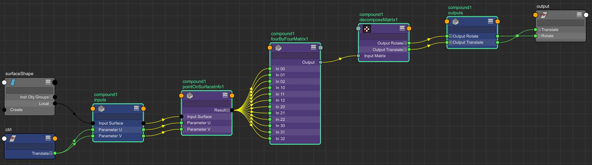
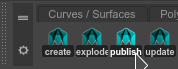
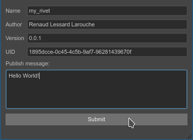
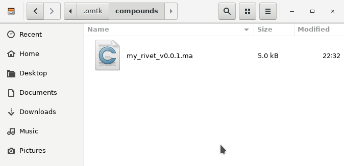
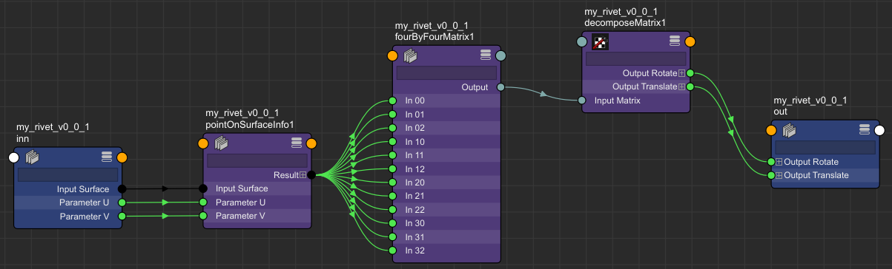

# omtk_compound

The goal of this project is to provide a universal mechanism to facilitate encapsulation based workflow in Maya.

> **WARNING**: This project is currently in alpha stage and should not be considered stable for production. 

## What is encapsulation?

Encapsulation is a common mechanism critical to domain like special effects and rigging. 
With encapsulation, multiple nodes can be grouped together in a "compound" that can be exported, versioned and reused.

This allow for a more flexible workflow that don't necessitate scripts to generate networks of node like in classical "autorigs".

Some examples of encapsulation mechanisms:

- [Houdini Digital Asset](https://www.sidefx.com/docs/houdini/assets/create.html)
- [Maya Bifrost](https://area.autodesk.com/blogs/the-maya-blog/introducing-bifrost-for-maya/)
- [Softimage Compound](https://vimeo.com/90308439) (dead)
- [Fabric Engine](https://vimeo.com/133021867) (dead)

To achieve encapsulation, we use maya namespaces.
They are annoying to use but they are a strong Maya feature that we can use to our advantage.

Consider the following hierarchy:



There are multiple things that are interesting about such hierarchy.

1) In Maya, no object can have the same name twice (ex: "root"), except if they differ in hierarchy or namespace. 
2) There are high chances that the content of the "arm_l" namespace is similar to the content of the "arm_r" namespace. 
3) The "character_1:arm_l" namespace is explicitly a child of the "character_1" namespace. 
This is hinted by the DAG nodes hierarchy but also apply to DG nodes as well.
 
To make compounds useful they need to be re-usable. For this we need to make them parameterizable. 
This is done by using two special nodes ("inputs" and "outputs").
This define an explicit interface for the compound are facilitate the creation of connection to it.

## Installing

Clone the repository to your preferred location.

```bash
git clone https://github.com/renaudll/omtk-compound.git
```

If you don't have git installed you can download the latest archive and extract it.

Then add the location to your `MAYA_MODULE_PATH` environment variable.

Finally, open maya. You should now have a "omtk_compound" shelf and access to the "omtk_compound" module.



## Usage

For this tutorial we are going to create a follicle setup like described in this excellent [article](https://bindpose.com/maya-matrix-nodes-part-3-matrix-rivet/).

We are gonna create the following network:



This network have a controller ("ctrl") where it's 2D position ("translateX" and "translateY") controls the UV position of a follicle.
As you can see, even if the network is simple it's still unpleasant to create by hand.
If you need to create multiple follicles, riggers often fallback to writing code like this one:

```python
from maya import cmds

cmds.loadPlugin("matrixNodes", quiet=True)

ctrl = cmds.createNode("transform", name="ctrl")
shape, _ = cmds.sphere(name="surface")
util1 = cmds.createNode("pointOnSurfaceInfo")
util2 = cmds.createNode("fourByFourMatrix")
util3 = cmds.createNode("decomposeMatrix")
output, = cmds.spaceLocator(name="output")

for src, dst in (
	("%s.local" % shape, "%s.inputSurface" % util1),
	("%s.translateX" % ctrl, "%s.parameterU" % util1),
	("%s.translateY" % ctrl, "%s.parameterV" % util1),
	("%s.positionX" % util1, "%s.in30" % util2),
	("%s.positionY" % util1, "%s.in31" % util2),
	("%s.positionZ" % util1, "%s.in32" % util2),
	("%s.normalX" % util1, "%s.in00" % util2),
	("%s.normalY" % util1, "%s.in01" % util2),
	("%s.normalZ" % util1, "%s.in02" % util2),
	("%s.tangentUx" % util1, "%s.in10" % util2),
	("%s.tangentUy" % util1, "%s.in11" % util2),
	("%s.tangentUz" % util1, "%s.in12" % util2),
	("%s.tangentVx" % util1, "%s.in20" % util2),
	("%s.tangentVy" % util1, "%s.in21" % util2),
	("%s.tangentVz" % util1, "%s.in22" % util2),
	("%s.output" % util2, "%s.inputMatrix" % util3),
	("%s.outputTranslate" % util3, "%s.translate" % output),
	("%s.outputRotate" % util3, "%s.rotate" % output),
):
    cmds.connectAttr(src, dst)
```

That's a lot of code! Which you can use to get started.
Hopefully we can do better with omtk_compound.

Start by selecting the main logic of the network. This include everything except the ctrl, shape and output locator.



Then click the "create" button in the "omtk_compound" shelf.



This will automatically:
- Create a new namespace "compound_1". (which is the default name)
- Put all selected nodes into this namespace.
- Create an "inputs" and "outputs" nodes which will host any connection pointing outside of the network.

You should now have the following network:



That's it we got a compound!
We can then register it by selecting any node in the compound and pressing the "publish" button in the shelf.



Simply fill the informations in the dialog and press "submit".



This should create a new file under the `~/.omtk/compounds` directory.



To re-use the compound, you can simply drag and drop it in maya to import it.
This will give you the same network than before but free of any ingoing and outgoing connections!
The metadata you entered at publish time is also embedded in the network for easier management. 



If you update the compound it afterward you can re-publish it with a higher version number.
Any outdated instances of the compound can easily be updated to their new version by selecting them and using the "update" button in the shelf.

For example if you fix a bug in the left arm, you can republish it and update the right arm.

## Running the tests

To run the tests, you'll need to have `pytest` and `pytest-cov` installed.

```bash
pip install pytest pytest-cov
```

Then, if you are on Linux or OSX you can execute `run_tests.sh`.

## Contributing

This project is currently in development. 

Do not hesitate to open a ticket if you need support or have ideas. :)
